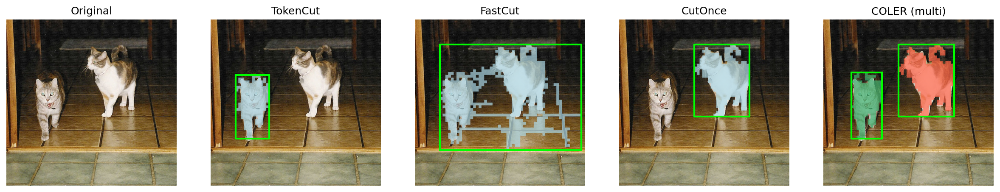
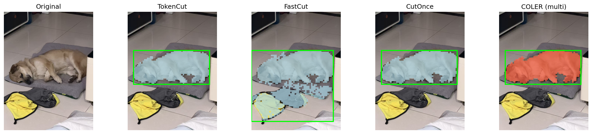
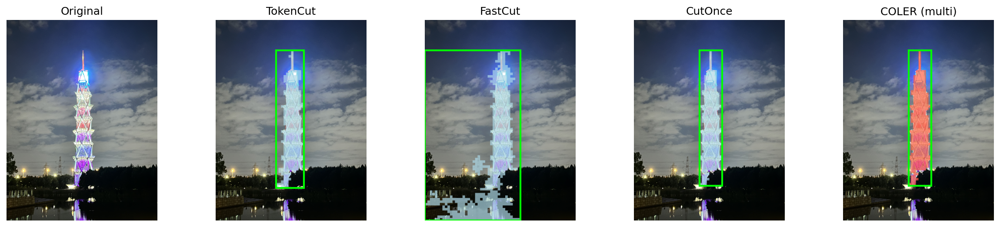
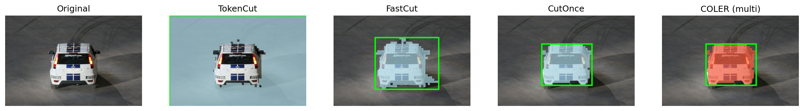
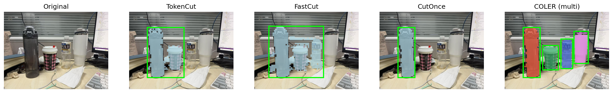

# CS240-TokenCut(NCut)-Segmentation-Efficient

Based on **TokenCut (CVPR 2022)**, this repo integrates a **Fast NCut (FastNCut)** solver and adds a **CutOnce / COLER** segmentation-oriented pipeline.

## Motivation

- Replace the original (slow) NCut eigensolver with **FastNCut** for efficiency.
- Improve robustness/segmentation quality with **CutOnce / COLER** (density-aware graph, boundary augmentation, multi-instance masks).

## What’s New (vs. the original TokenCut repo)

### 1) FastCut (FastNCut in TokenCut)
- TokenCut builds a token graph and solves a cut via eigendecomposition.
- This repo provides a FastNCut-based variant (FastCut) that replaces the eigensolver with a projected power method under linear constraints.
- Code:
  - FastNCut solver: `tokencut/fastncut.py`
  - Wrapper entry: `tokencut/object_discovery.py` (`fast_ncut_optimized(...)`)

### 2) CutOnce / COLER (segmentation-oriented)
CutOnce/COLER focuses on segmentation quality and multi-instance outputs:
- **Density-aware affinity**: adaptive temperature scaling before thresholding the similarity graph.
- **Boundary augmentation**: enhance the Fiedler vector using local boundary/gradient cues.
- **Multi-instance masks (COLER)**: connected components + ranking-based instance filter (+ optional CRF).

More details: `coler_cutonce_explanation.md`

## Original NCut (reference)

Original implementation lives in `tokencut/object_discovery.py` (`ncut(...)`).

**Implementation of NCut Method.**
Inputs:
- `feats`: the pixel/patch features of an image
- `dims`: dimension of the map from which the features are used
- `scales`: from image to map scale
- `init_image_size`: size of the image
- `tau`: threshold for graph construction
- `eps`: graph edge weight
- `im_name`: image name (optional)
- `no_binary_graph`: use weighted edges instead of binary thresholding

## Installation

Recommended environment setup (tested with the original TokenCut stack):
```bash
conda create -n tokencut python=3.7
conda activate tokencut
pip install torch==1.7.1+cu110 torchvision==0.8.2+cu110 -f https://download.pytorch.org/whl/torch_stable.html
pip install -r requirements.txt
```

Alternatively, if you have `environment.yaml` (exported from a working setup), you can create the environment directly:
```bash
conda env create -f environment.yaml
conda activate tokencut
```

If you use a different CUDA/PyTorch version, make sure `torch` and `torchvision` match your CUDA runtime.

Install PyTorch + torchvision first (match your CUDA/CPU), then:
```bash
pip install -r requirements.txt
```

Notes:
- DINO weights are downloaded via `torch.hub.load_state_dict_from_url` and cached under `~/.cache/torch/hub/checkpoints/`.
- `--use_crf` requires `pydensecrf` (optional).

## Usage

### Compare demo (recommended)
Run **TokenCut / FastCut / CutOnce / COLER** on the same image and save overlays + masks:
```bash
python compare_methods.py --image_path examples/VOC07_000064.jpg
```

By default, `compare_methods.py` downsamples the input to a **480p-ish box (<= 854×480)** to avoid `N×N` affinity OOM.
Disable this behavior:
```bash
python compare_methods.py --image_path examples/VOC07_000064.jpg --resize_preset none
```

### Batch compare on multiple example images
Run the compare demo on a predefined list of images under `examples/`:
```bash
bash run_compare_examples.sh
```

You can override default model settings via env vars:
```bash
ARCH=vit_base PATCH_SIZE=8 bash run_compare_examples.sh
```

Outputs:
- `outputs/compare/<image_stem>/compare.png`
- `outputs/compare/<image_stem>/*_overlay.png`
- `outputs/compare/<image_stem>/*_mask.png`
- `outputs/compare/<image_stem>/coler_instance_*.png`
- `outputs/compare/<image_stem>/timings.txt` (detailed step timings)

### Timing notes

`compare_methods.py` prints a short timing summary and writes a detailed breakdown to `outputs/compare/<image_stem>/timings.txt`.

What we measure:
- `total`: wall-clock time of the whole script (from start to finish), including one-time overheads (e.g., CUDA initialization, weight download/cache, library warm-up).
- `tokencut`: **method time** = `load + features + infer + post + save` for TokenCut.
- `fastcut`: **method time** = `load + features + infer + post + save` for FastCut.
- `cutonce`: **method time** = `load + features + infer + post + save` for CutOnce.
- `coler`: **method time** = `post + save` on top of the CutOnce eigen-vector (COLER reuses CutOnce’s `eigen_vec` by design in this demo).

Where to find the breakdown:
- `timings.txt` contains `setup_s` (image I/O + preprocessing) and per-method step breakdown:
  - `load_s`: model creation + weight loading (may trigger downloads on first run)
  - `features_s`: forward pass / feature extraction
  - `infer_s`: graph + NCut/FastNCut solver
  - `post_s`: upsample/mask processing/overlay/bbox construction
  - `save_s`: writing per-method outputs to disk

## Results

### Qualitative comparison (single image)

Example outputs from `compare_methods.py`:

#### 005519


#### 9fa1dbca4dab51c6aeb76b9113327bbc


#### IMG_2843


#### VOC07_000012


#### ex1


### Quantitative evidence for FastCut speedup

The following tables summarize NCut vs. FastNCut results (CorLoc and total runtime) on common benchmarks.

**VOC07 (NCut vs FastNCut)**

| Methods | CorLoc (%) | Time (s) |
|---|---:|---:|
| NCut | 68.8 | 112.11 |
| FastNCut | 51.2 | 17.45 |

**VOC12 (NCut vs FastNCut)**

| Methods | CorLoc (%) | Time (s) |
|---|---:|---:|
| NCut | 72.1 | 266.39 |
| FastNCut | 58.1 | 45.50 |

**COCO20k (NCut vs FastNCut)**

| Methods | CorLoc (%) | Time (s) |
|---|---:|---:|
| NCut | 58.8 | 740.23 |
| FastNCut | 39.7 | 75.45 |

### TokenCut (single image)
```bash
python main_tokencut.py --image_path examples/VOC07_000012.jpg --visualize all
```

### TokenCut (dataset)
```bash
python main_tokencut.py --dataset COCO20k --set train
```

### COLER (single image)
```bash
python run_coler.py --img_path examples/VOC07_000064.jpg --arch vit_base --patch_size 8 --tau 0.15
```
